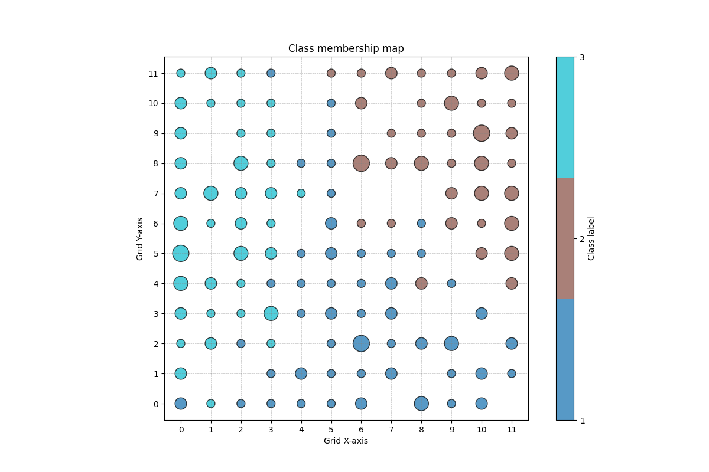
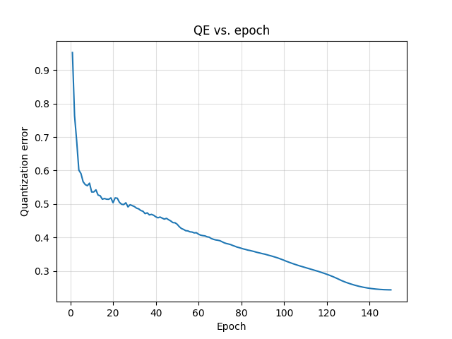
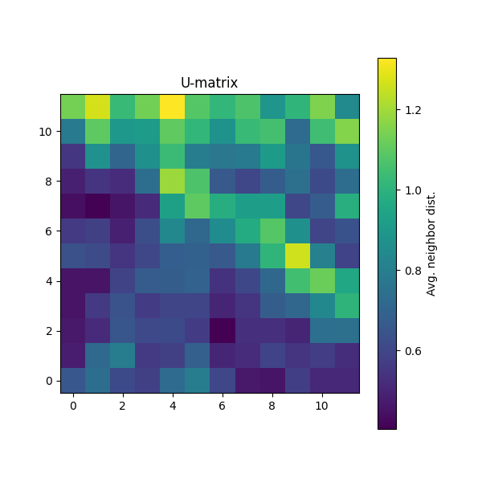
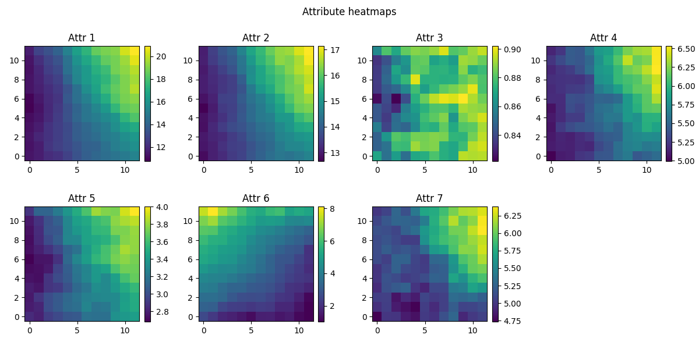

# Recurrent Self-Organizing Networks

## Overview
This project focuses on SOM, RSOM, and MSOM models and their use in temporal sequence learning.
The goal is to implement these models in Python, debug their behavior, and test their ability to
represent temporal patterns.

## Current Progress
- Implemented SOM, RSOM, MSOM in Python
- Added GPU-accelerated vectorized versions
- Implemented visualization tools (U-matrix, BMU maps, context evolution)
- Performed hyperparameter searches for all models
- Created pre-defense presentation and partial thesis chapters

## Materials
- **Thesis (PDF):** [Recurrent_self-organizing_networks.pdf](./docs/Recurrent_self-organizing_networks.pdf)
- **Pre-defense presentation (PPTX):** [Prototyp_prez.pptx](./docs/Prototyp_prez.pptx)

## Source Code
Repository containing:
- `SOM.py`, `SOM_vectorized.py`
- `RSOM.py`, `RSOM_cp_vectorized.py`
- `MSOM.py`
- testing scripts for SOM, RSOM, MSOM

## Datasets
- Seeds dataset
- Mackey–Glass time series

Example visualization outputs: 

